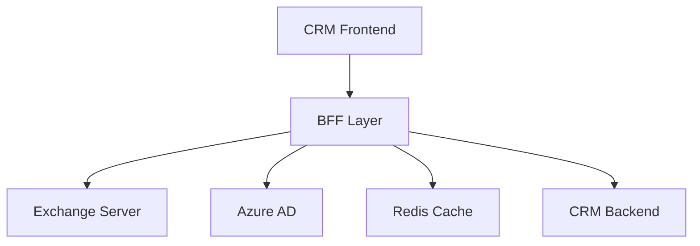

<div align="center">

# 🔄 Exchange-CRM Integration

[](https://www.typescriptlang.org/)
[](https://reactjs.org/)
[](https://fastapi.tiangolo.com/)
[](https://mui.com/)
[](https://redis.io/)

A powerful, enterprise-grade integration between Exchange Server 2019+ and browser-based CRM systems, enabling seamless communication and data synchronization in zero-trust environments.

[Features](#features) •
[Architecture](#architecture) •
[Installation](#installation) •
[Documentation](#documentation) •
[Contributing](#contributing)

</div>

---

## 🌟 Overview

The Exchange-CRM Integration system bridges the gap between Microsoft Exchange Server and modern CRM applications, providing a unified interface for email, calendar, and contact management. Built with security and performance in mind, it leverages Azure AD authentication and implements a zero-trust security model.

### Key Benefits

- 🔒 **Enterprise Security**: Zero-trust architecture with Azure AD integration
- 🚀 **High Performance**: Redis caching and optimized data handling
- 🔄 **Real-time Sync**: Instant updates across all integrated systems
- 🎯 **Seamless UX**: Unified interface within existing CRM
- 📱 **Responsive Design**: Full functionality across all devices

## ✨ Features

### 📧 Mail Integration
- Real-time email synchronization
- Rich text message composition
- Secure attachment handling
- Advanced search and filtering
- Hierarchical folder management

### 📅 Calendar Integration
- Interactive calendar views (Day/Week/Month)
- Drag-and-drop event management
- Recurring event support
- Attendee management with status tracking
- Resource booking integration

### 👥 Contact Integration
- Bi-directional contact sync
- Advanced contact search
- Comprehensive contact profiles
- Multiple email/phone support
- Business relationship tracking

## 🏗 Architecture

### System Overview


### Key Components

#### Frontend Layer
- React with TypeScript
- Material-UI components
- Redux state management
- Real-time updates via WebSocket
- Responsive design system

#### Backend Layer
- FastAPI application
- Microsoft Graph API integration
- Exchange Web Services (EWS)
- Redis caching system
- Zero-trust security model

#### Integration Points
- Azure Active Directory
- Exchange Server 2019+
- Redis Cache
- Existing CRM Systems

## 🛠 Technical Stack

### Frontend Technologies
```typescript
{
  "framework": "React 18+",
  "language": "TypeScript 4.9+",
  "stateManagement": "Redux Toolkit",
  "ui": "Material-UI v5",
  "formHandling": "Formik + Yup",
  "testing": "Jest + Testing Library"
}
```

### Backend Technologies
```python
{
  "framework": "FastAPI",
  "caching": "Redis",
  "authentication": "Azure AD",
  "database": "PostgreSQL",
  "testing": "pytest",
  "documentation": "OpenAPI"
}
```

## 📚 Documentation

- [Installation Guide](./docs/installation.md)
- [API Documentation](./docs/api.md)
- [Security Overview](./docs/security.md)
- [Development Guide](./docs/development.md)
- [Deployment Guide](./docs/deployment.md)

## 🚀 Quick Start

```bash
# Clone the repository
git clone https://github.com/your-org/exchange-crm-integration.git

# Install dependencies
cd exchange-crm-integration
./install-deps.sh

# Configure environment
cp .env.example .env

# Start development servers
docker-compose up -d
npm start
```

## 🤝 Contributing

We welcome contributions! Please see our [Contributing Guide](CONTRIBUTING.md) for details.

## 📄 License

This project is licensed under the MIT License - see the [LICENSE](LICENSE) file for details.

## 🎯 Roadmap

- [ ] OAuth 2.0 Device Flow Support
- [ ] Multi-tenant Architecture
- [ ] AI-powered Email Categories
- [ ] Advanced Analytics Dashboard
- [ ] Mobile Application Support

## 👨‍💻 Author

**George Nassef**
- GitHub: [@georgenassef](https://github.com/georgenassef)
- LinkedIn: [George Nassef](https://linkedin.com/in/georgenassef)

## 🙏 Acknowledgments

- Microsoft Exchange Team
- FastAPI Community
- React Core Team
- Material-UI Contributors

---

<div align="center">

Made with ❤️ by George Nassef

</div>
